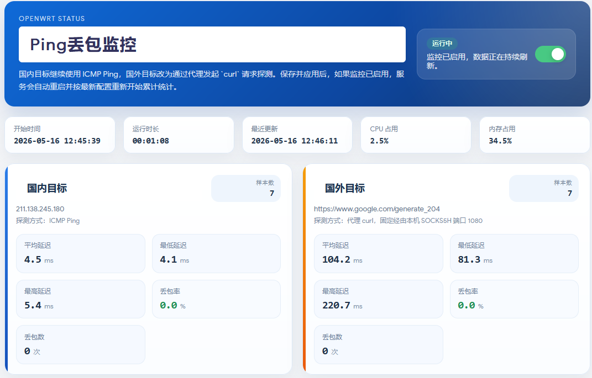
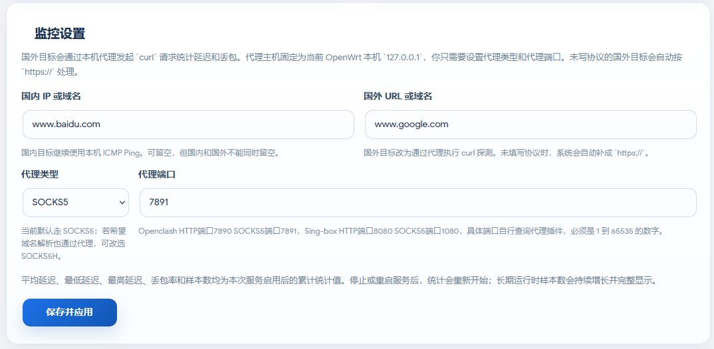
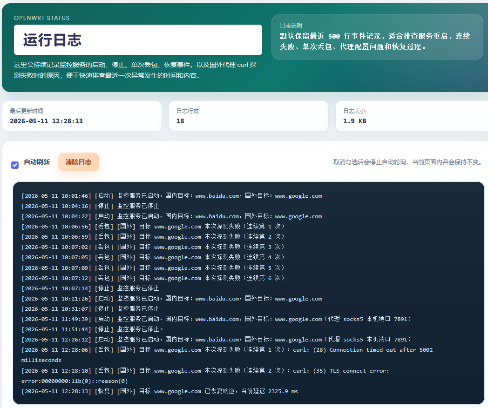

# luci-app-pingpacket

## 界面截图

<table>
  <tr>
    <td width="50%" align="center">
      
      <br>
      <sub>监控总览</sub>
    </td>
    <td width="50%" align="center">
      
      <br>
      <sub>监控设置</sub>
    </td>
  </tr>
  <tr>
    <td colspan="2" align="center">
      
      <br>
      <sub>运行日志</sub>
    </td>
  </tr>
</table>

`luci-app-pingpacket` 是一个面向 OpenWrt 的 LuCI 状态监控插件，用于持续检测国内与国外目标的连通性、延迟和丢包情况，并提供运行日志、服务控制与简单排障能力。

## 适用平台

- OpenWrt 24.10.x
- 已安装 LuCI Web 管理界面
- 适合需要同时观察国内直连质量和国外代理访问质量的 OpenWrt 设备
- 当前仓库的构建示例主要面向 `x86/64` SDK，但插件本身为 LuCI 页面和 shell 脚本，原则上可用于支持 LuCI 的其它 OpenWrt 架构

## 页面位置

后台菜单路径：

`状态 -> Ping丢包监控`

子页面：

- `监控`
- `日志`

## 主要功能

### 监控页

- 支持分别配置国内目标和国外目标
- 国内目标使用本机 `ping` 进行 ICMP 探测
- 国外目标使用 `curl` 通过代理发起请求探测，更接近代理实际访问质量
- 国外目标支持输入域名或完整 URL
- 未填写协议的国外目标会自动按 `https://` 处理
- 支持配置国外探测代理类型、代理端口
- 国外代理主机默认固定为 OpenWrt 本机 `127.0.0.1`
- 页面内可直接启用或关闭监控服务
- 点击“保存并应用”后会保存配置；若当前监控已启用，会自动重启服务并按新配置重新开始统计
- 当页面检测到“数据停滞”时，会直接显示“重新启动服务”按钮
- 实时显示开始时间、运行时长、最近更新时间、CPU 占用、内存占用

### 统计项

国内与国外分别独立统计以下数据：

- 平均延迟
- 最低延迟
- 最高延迟
- 丢包率
- 样本数

统计口径：

- 以上数据均为“本次服务启用后的累计统计值”
- 停止服务或重启服务后，统计会重新开始
- 国内和国外样本数分别累计，不做合并

### 日志页

- 显示插件运行日志
- 页面顶部支持自动刷新开关
- 默认启用自动刷新
- 提供“清除日志”按钮
- 显示日志最后更新时间、日志行数、日志大小
- 默认保留最近 500 行日志

### 日志记录内容

当前会记录以下事件：

- 服务启动时间与目标配置
- 服务停止时间
- 单次丢包事件
- 恢复事件
- 国外代理探测失败原因，例如代理未配置、`curl` 失败等

日志规则：

- 只要单次探测失败，就立即记录一条丢包日志
- 连续失败时，每次失败都会单独记录
- 故障后的首次成功响应会记录一条恢复日志

## 配置规则

- 国内和国外目标不能同时留空
- 点击“保存并应用”时，如果两个目标都为空，会提示必须至少填写一个目标
- 点击开关启用监控时，如果两个目标都为空，也会提示必须至少填写一个目标
- 若填写了国外目标，则必须同时填写代理端口
- 代理端口必须是 `1-65535` 的数字
- 页面轮询刷新时，不会覆盖用户正在编辑但尚未保存的输入内容

## 默认配置

安装脚本会在缺失时补齐以下默认目标：

- 国内：`www.baidu.com`
- 国外：`https://www.google.com/generate_204`
- 国外代理类型：`socks5`
- 国外代理端口：`7891`

默认 UCI 结构如下：

```uci
config pingpacket 'config'
	option enabled '0'
	option domestic_target ''
	option foreign_target 'https://www.google.com/generate_204'
	option foreign_proxy_type 'socks5'
	option foreign_proxy_host '127.0.0.1'
	option foreign_proxy_port '7891'
```

## 依赖

- `luci-base`
- `luci-lua-runtime`
- `luci-compat`
- `curl`

## 安装

将编译好的 IPK 上传到 OpenWrt 设备后执行：

```sh
opkg install luci-app-pingpacket_*.ipk
```

升级安装时：

- 现有 `/etc/config/pingpacket` 会尽量保留
- 若系统中存在历史遗留的 `/etc/config/pingpacket-opkg`，安装脚本会尽量清理

## 主要文件

- LuCI 控制器：`luci-app-pingpacket/luasrc/controller/pingpacket.lua`
- 监控页模板：`luci-app-pingpacket/luasrc/view/pingpacket/status.htm`
- 日志页模板：`luci-app-pingpacket/luasrc/view/pingpacket/logs.htm`
- 服务脚本：`luci-app-pingpacket/root/etc/init.d/pingpacket`
- 采集脚本：`luci-app-pingpacket/root/usr/bin/pingpacket.sh`

## 运行时文件

- 状态文件：`/tmp/pingpacket_status.json`
- 日志文件：`/tmp/pingpacket.log`
- CPU 采样缓存：`/tmp/pingpacket_cpu_state`
- 运行目录：`/var/run/pingpacket`
